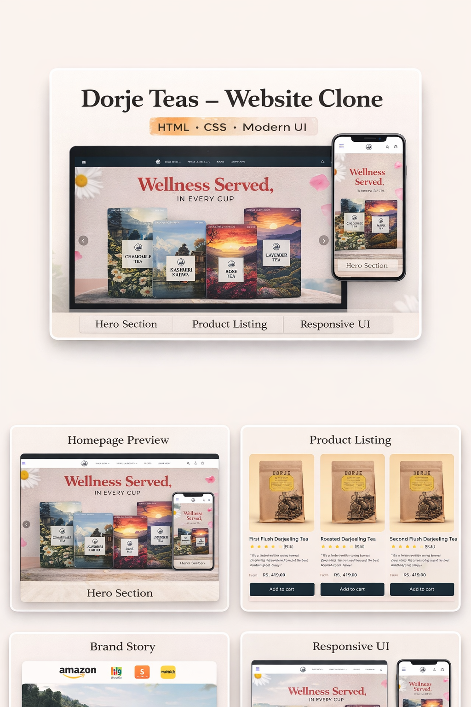

# Dorje Teas Website Clone ☕🌿

A **pixel-perfect, fully responsive frontend clone** of the **Dorje Teas e-commerce website**.  
This project showcases strong command over **HTML5, CSS3, and Vanilla JavaScript**, focusing on modern UI architecture, responsive design systems, and clean, maintainable code — without using any external CSS frameworks.

---

## 🖥️ Website Preview



> A glimpse of the Landing Page and Collections interface (Desktop & Mobile responsive views).

---

## 📖 Project Description

This project is a **high-fidelity recreation** of the Dorje Teas digital storefront.  
The primary objective was to **reverse-engineer a production-grade e-commerce UI** to demonstrate mastery of core frontend engineering concepts.

### Key Engineering Focus Areas:

- **Structural Semantics**  
  Implemented proper HTML5 semantic elements to improve accessibility, readability, and SEO structure.

- **Advanced CSS Architecture**  
  Leveraged **Flexbox and CSS Grid** for complex layouts such as product cards, navigation menus, and multi-column footers.

- **Responsive Design**  
  Followed a **mobile-first approach** with optimized media queries to ensure seamless rendering across:
  - 4K Desktops
  - Laptops
  - Tablets
  - Mobile Devices

- **Custom Interactivity**  
  Built interactive components using **pure Vanilla JavaScript**, avoiding external libraries to demonstrate core DOM mastery.

---

## ✨ Key Features

- **Fully Responsive Design**  
  Fluid layout across all screen sizes  
  _(Breakpoints: 1200px, 992px, 768px, 576px)_

- **Modern Navigation System**  
  Sticky navbar with dropdown menus, hover effects, and smooth transitions.

- **Dynamic Sliders & Carousels**  
  Custom JavaScript sliders for:
  - Hero Section  
  - Testimonials  
  - Product Playlists

- **Media Integration**  
  Embedded background videos and YouTube iframe sections for promotional content.

- **CSS Grid Product Layout**  
  Robust grid system used for **Best Sellers** and **Collections** pages.

- **Multi-Page Architecture**
  - `index.html` — Landing Page  
  - `collections.html` — Product Catalog  
  - `accounts.html` — Login / Signup UI  

- **Cross-Browser Compatibility**  
  Tested on Chrome, Firefox, Safari, and Edge.

---

## 🛠️ Tech Stack

**Markup**
- HTML5 (Semantic Elements)

**Styling**
- CSS3  
  - CSS Variables  
  - Flexbox  
  - Grid  
  - Media Queries  
  - Keyframe Animations  

**Scripting**
- Vanilla JavaScript  
  - DOM Manipulation  
  - Event Handling  

**Assets & Fonts**
- Google Fonts (Poppins, Questrial, Fraunces)
- Font Awesome Icons

---

## 📂 Folder Structure

```bash
Dorje-Teas-Clone/
│
├── Dorjteas_assets/            # Images, icons, SVGs
├── accounts.html               # Login & Signup UI
├── collection.css              # Collection page styles
├── collection-media-quary.css  # Collection page responsiveness
├── collections.html            # Product catalog page
├── index.html                  # Main landing page
├── media-quary.css             # Landing page responsiveness
├── script.js                   # Sliders & navigation logic
├── style.css                   # Global styles & CSS variables
├── LICENSE                     # MIT License
└── README.md                   # Project documentation


## 🚀 How to Run Locally

Follow these steps to run the project on your local machine:

### 1. Clone the repository
```bash
git clone https://github.com/your-username/dorje-teas-clone.git

cd dorje-teas-clone


⚖️ License & Credits
License

Distributed under the MIT License.
See the LICENSE file for more information.

Disclaimer

This project is created strictly for educational and portfolio purposes.
All product images, logos, and brand assets belong to Dorje Teas.
This project is not affiliated with or endorsed by Dorje Teas.

## 📬 Contact

Ronit Kumar Soni  
Frontend Developer | Open-Source Enthusiast  

• GitHub:  RonitkumarSoni
• LinkedIn: 
• Email: ronitkumarsoni.cg@gmail.com
